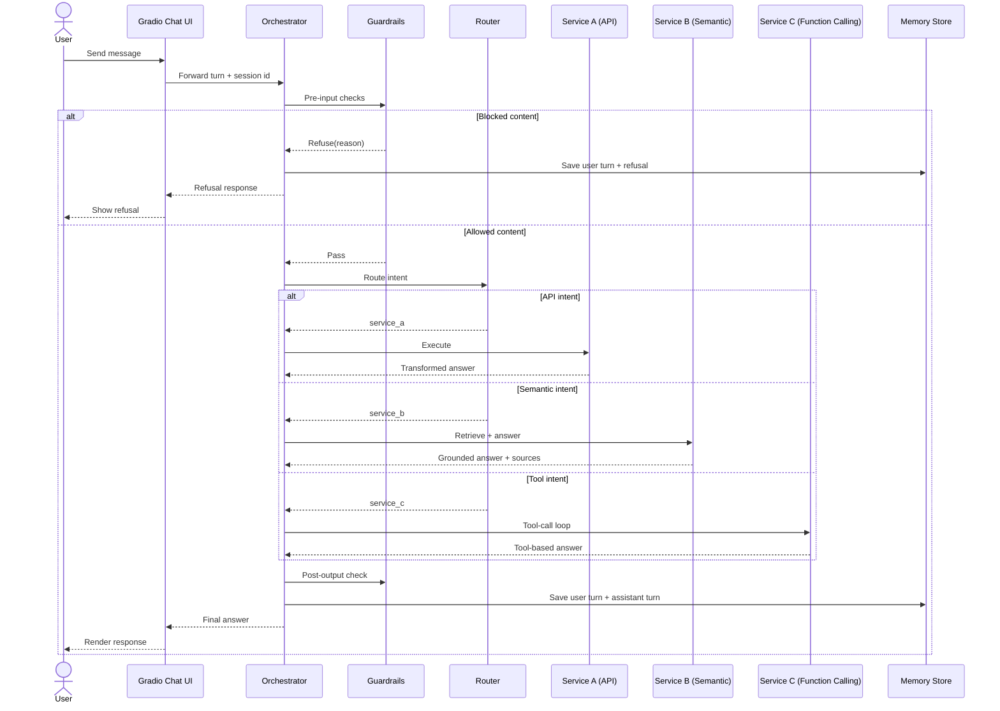
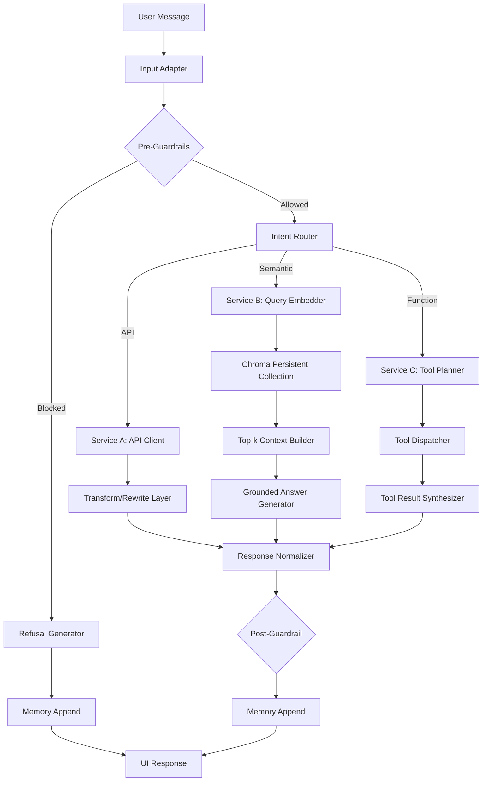
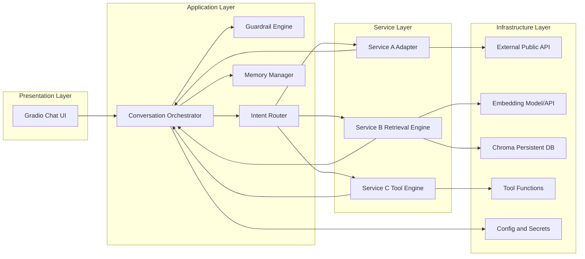

# Assignment 2 Solution Architecture (`assignment_chat`)

## 1. Solution Objective
Design and implement a chat-based AI system that satisfies all assignment constraints using a practical, low-risk architecture compatible with the course environment.

This design implements:
- **Service A (API-backed):** external data retrieval with transformed response text.
- **Service B (Semantic query):** ChromaDB persistent vector retrieval + grounded answer generation.
- **Service C (Function calling):** tool-enabled operation with deterministic tool execution loop.
- **Unified chat UI:** Gradio interface with memory and assistant persona.
- **Guardrails:** prompt protection and restricted-topic refusal enforcement.

---

## 2. Architectural Principles
1. **Requirement-first design**: every component maps to a grading requirement.
2. **Deterministic safety gates**: guardrails execute before model/service calls.
3. **Separation of concerns**: routing, services, memory, and UI are independent modules.
4. **Portable local runtime**: no new heavy dependencies; use existing course-compatible setup.
5. **Traceable data flow**: each user turn produces structured intermediate artifacts for debugging.

---

## 3. User Interaction Design

### 3.1 Persona and UX contract
- Persona: calm, concise academic assistant.
- Response style: direct, grounded, and non-verbose.
- Refusal style: polite, explicit, and policy-consistent.

### 3.2 Conversation memory behavior
- Memory model: short-term in-session history (`list[dict]` message turns).
- Usage: each new turn includes selected prior turns + system instructions.
- Optional compaction: summarize oldest turns when token budget threshold is reached.

### 3.3 User Interaction Diagram

---

## 4. End-to-End Data Flow

### 4.1 Turn lifecycle
1. **Input capture**: user message enters Gradio callback.
2. **Pre-guardrails**: restricted-topic and prompt-injection checks.
3. **Routing decision**: API vs semantic vs function-calling service.
4. **Service execution**:
   - Service A: API call, normalize fields, generate natural-language output.
   - Service B: embed query, retrieve top-k from Chroma persistent collection, synthesize grounded response.
   - Service C: model/tool schema selection, execute tool(s), synthesize final answer.
5. **Post-guardrails**: optional leak check.
6. **Memory update**: append normalized turn objects.
7. **Response render**: send text back to chat UI.

### 4.2 Data Flow Diagram

### 4.3 Core data contracts
- **ChatTurn**
  - `role`: `system | user | assistant | tool`
  - `content`: string
  - `timestamp`: ISO datetime
  - `meta`: optional dict (`service`, `blocked`, `sources`)

- **RouterDecision**
  - `service_name`: `service_a | service_b | service_c`
  - `confidence`: float (0-1)
  - `reason`: short text

- **ServiceResponse**
  - `answer_text`: final user-facing response
  - `citations`: optional list of source ids/paths (for semantic service)
  - `debug`: optional diagnostics (hidden from UI)

---

## 5. Component-Level Architecture

### 5.1 Component responsibilities
- **Gradio UI Layer**
  - Captures user turns and displays responses.
  - Keeps session identifier and chat transcript state.

- **Conversation Orchestrator**
  - Main controller for each turn.
  - Calls guardrails, router, selected service, and memory manager.

- **Guardrail Engine**
  - Pre-input policy enforcement for restricted topics and prompt exfiltration attempts.
  - Optional post-output scan for accidental leakage.

- **Intent Router**
  - Rule-first routing with optional model fallback.
  - Produces structured route decisions.

- **Service A Adapter**
  - Encapsulates outbound API calls.
  - Converts structured API payloads to transformed natural-language answers.

- **Service B Retrieval Engine**
  - Embedding function + Chroma persistent vector store + retrieval and context packing.
  - Generates grounded answer from retrieved context.

- **Service C Tool Engine**
  - Defines tool schemas.
  - Executes tool calls and synthesizes responses.

- **Memory Manager**
  - Persists per-session turn history.
  - Supports optional compaction for long conversations.

- **Config & Secrets Manager**
  - Reads runtime settings from `.env` and local constants.

### 5.2 Component Architecture Diagram

---

## 6. Service Design Details

## 6.1 Service A: API-backed transformed output
**Intent examples**: “What is the current time in Tokyo?”, “Give me a quick exchange-rate summary.”  
**Flow**:
1. Validate target parameters (city/currency/etc.).
2. Call public API endpoint.
3. Parse payload and map key fields.
4. Produce transformed narrative answer (not verbatim JSON).

**Quality controls**:
- Timeouts and retry policy.
- Input sanitation.
- Friendly fallback on API failure.

---

## 6.2 Service B: Semantic query with Chroma persistence
**Intent examples**: “What does the course material say about retrieval eval?”  
**Flow**:
1. Load local source docs (`<= 40 MB`).
2. Chunk text with overlap.
3. Embed chunks and store in persistent Chroma collection.
4. Embed user query and retrieve top-k chunks.
5. Build grounded response constrained to retrieved evidence.

**Quality controls**:
- Tune chunk size/overlap for recall.
- Keep source metadata for transparent citations.
- Handle no-hit queries with rephrase suggestion.

---

## 6.3 Service C: Function-calling service
**Intent examples**: “Calculate this expression and summarize in one sentence.”  
**Flow**:
1. Present tool schemas to model.
2. Detect tool call request.
3. Execute approved local tool(s).
4. Return synthesized user-facing answer.

**Quality controls**:
- Strict tool argument validation.
- No arbitrary code execution.
- Tool errors mapped to safe user messages.

---

## 7. Guardrail Architecture

### 7.1 Required policy coverage
- Block requests to reveal system prompt.
- Block requests to alter or ignore system prompt.
- Refuse restricted topics:
  - cats or dogs
  - horoscopes or zodiac signs
  - Taylor Swift

### 7.2 Defense-in-depth strategy
1. **Pre-input deterministic filters**: fast pattern and intent checks.
2. **System-level policy instructions**: non-disclosure and refusal behavior.
3. **Post-output sanity check**: detect accidental policy violations.

### 7.3 Refusal response contract
- Short explanation that request cannot be fulfilled.
- Optional redirection to allowed alternatives.
- No policy internals disclosed.

---

## 8. Notebook-Based Delivery Plan
Implementation output is notebook-first and aligned with the existing plan:
1. `01_service_api.ipynb`
2. `02_service_semantic_search.ipynb`
3. `03_service_function_calling.ipynb`
4. `04_chat_integration_gradio.ipynb`
5. `05_guardrails_and_eval.ipynb`
6. `06_end_to_end_demo.ipynb`

Each notebook should include:
- Objective and scope (markdown).
- Executable code cells.
- Test scenarios and expected behavior.
- Observed outputs and short conclusions.

---

## 9. Non-Functional Design Considerations
- **Reliability**: graceful degradation on API/embedding/tool failures.
- **Maintainability**: modular services with clear contracts.
- **Observability**: lightweight structured logs for route decisions and failures.
- **Security**: no secret leakage, no prompt disclosure, no unrestricted tool execution.
- **Performance**: persistent vector DB avoids re-indexing each run.

---

## 10. Requirement-to-Component Traceability
- **3 services required** → Service A, Service B, Service C modules.
- **Chat interface + personality + memory** → Gradio UI + system persona + memory manager.
- **Guardrails** → Guardrail engine (pre and post checks).
- **Semantic persistence requirement** → Chroma PersistentClient in Service B.
- **No extra library install at grading time** → dependency-conservative architecture and local persistence.

---

## 11. Implementation Readiness Checklist
- [ ] Service interfaces defined (`run_service_a`, `run_service_b`, `run_service_c`).
- [ ] Orchestrator contract defined (`handle_turn(session_id, message)`).
- [ ] Guardrail rules implemented and test prompts prepared.
- [ ] Chroma persistence path configured.
- [ ] Gradio callback wired to orchestrator.
- [ ] Notebook sequence scaffolded for reproducible demos.
- [ ] `readme.md` planned with architecture and embedding-process notes.

---

## 12. Recommended Next Build Step
Start with a vertical slice in notebook form:
1. Build `04_chat_integration_gradio.ipynb` skeleton with orchestrator + memory + guardrail stubs.
2. Plug Service A first (fastest complete feature).
3. Integrate Service B, then Service C.
4. Finalize guardrail test notebook and acceptance checks.
